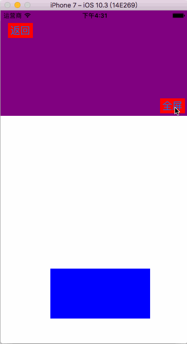
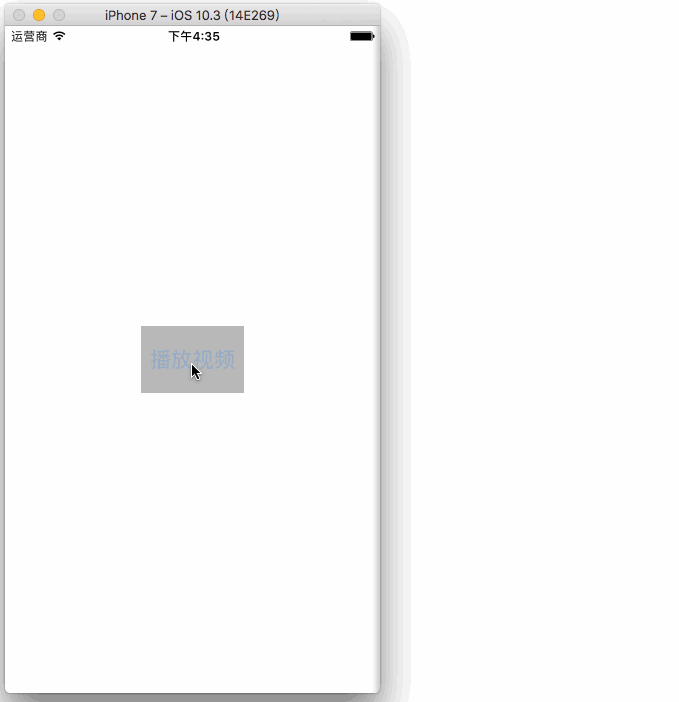
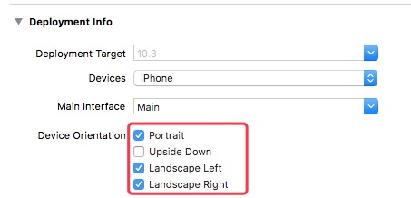
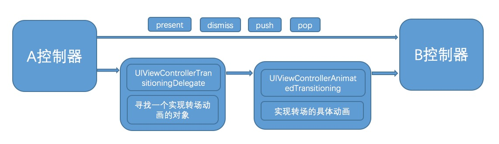
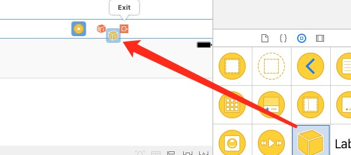
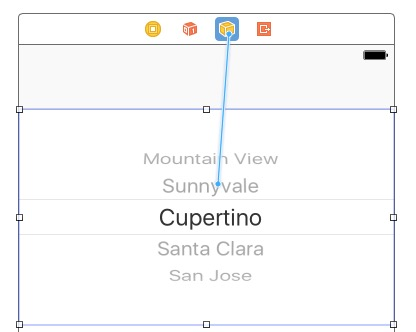
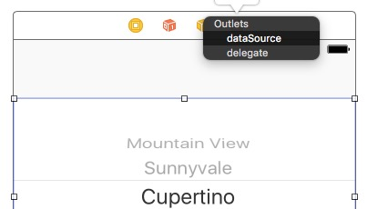
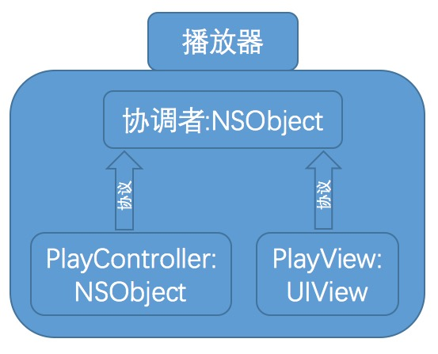

浅谈IOS视频全屏播放、屏幕旋转与控制器转场动画，妈妈再也不用担心APP上架被拒了
===

来一波大神的写的[https://github.com/DevLiYang/LYCustomTransition](https://github.com/DevLiYang/LYCustomTransition)  这里有各种各样的转场动画(交互式、非交互式)，微信的、酷狗的等等…

还有[https://github.com/alanwangmodify/WXSTransition](https://github.com/alanwangmodify/WXSTransition) 这位大神挺狠，**50种动画**。


###全屏的实质
如果摒弃掉Apple不建议的方法，那么在IOS8之后，横屏全屏的实质是弹出一个控制器，控制器支持的方向为横屏即可。我们看到的**视频旋转**实际上是定义了一个控制器切换的**转场动画**。

>* 竖屏切横屏：弹出一个横屏的控制器
>* 横屏返回竖屏：dismiss掉横屏控制器

####需求

>* 可手动触发旋转
>* 可跟随手机屏幕旋转（不论设备是否开启屏幕旋转功能）

**如下图**



 
####准备阶段

####一、我们在`TARGET`中经常会只保留一个方向，我建议三个都勾选上，控制器的方向我个人觉得控制器自己去控制就好。




####二、竖屏控制器 `VerticallyVideoVC`

控制器内要实现四个方法

```

-(BOOL)prefersStatusBarHidden{
    
    return NO;
}

-(BOOL)shouldAutorotate{
    
    return NO;
}

-(UIInterfaceOrientationMask)supportedInterfaceOrientations{
    
    return UIInterfaceOrientationMaskPortrait;
}

-(UIInterfaceOrientation)preferredInterfaceOrientationForPresentation{
    
    return UIInterfaceOrientationPortrait;
}

```

四个方法都比较好理解，不再赘述。
#####这里要注意一下的就是，如果这个控制器带有导航的，那么屏幕方向由导航去控制的，所以要在 `NavigationController` 中去控制，为了方便我们可以自定义一个导航，并实现上面的几个方法

```

- (BOOL)shouldAutorotate{
    
    return [[self.viewControllers lastObject] shouldAutorotate];
}

- (UIInterfaceOrientationMask)supportedInterfaceOrientations{
    
    return [[self.viewControllers lastObject] supportedInterfaceOrientations];
}

- (UIInterfaceOrientation)preferredInterfaceOrientationForPresentation {
    
    return [[self.viewControllers lastObject] preferredInterfaceOrientationForPresentation];
}

-(BOOL)prefersStatusBarHidden{
    
    return [[self.viewControllers lastObject] prefersStatusBarHidden];
}

```

**其实就是把屏幕的方向交给了导航栈顶的控制器去控制。**

####三、横屏控制器 `HorizontallyVideoVC`
在这个控制器内同样也实现上面的几个方法

```

-(BOOL)prefersStatusBarHidden{
    
    return NO;
}

-(BOOL)shouldAutorotate{
    
    return NO;
}

-(UIStatusBarStyle)preferredStatusBarStyle{
    
    return UIStatusBarStyleDefault;
}

-(UIInterfaceOrientationMask)supportedInterfaceOrientations{
    
    return UIInterfaceOrientationMaskLandscapeRight;
}

-(UIInterfaceOrientation)preferredInterfaceOrientationForPresentation{

    return UIInterfaceOrientationLandscapeRight;
}

```

**到此为止，如果直接用竖屏控制区去present出横屏控制器的话就是我们需要的横屏到竖屏的效果，通过状态栏可以看出，所以状态栏目前都没有隐藏**

但是发现没有动画啊，就解决了横屏到竖屏的转换。那么这里就需要定义一个动画，用来实现横竖屏的过渡，下面是第四个准备工作，负责转场动画的类。

####四、转场动画控制 `RotateAnimator`

在控制器跳转前会找一个`delegate`去调用下跳转过渡的方法，如果你没有实现这个方法就默认用系统的方法，如果你实现了，就会按照你的方法执行。控制器有个`transitioningDelegate`属性，就是不管`PUSH` `POP` `PRESENT` `DISMISS` 任意一种方式跳转，都会让 `transitioningDelegate ` 这个对象调用对应的协议方法去实现自定义的转场动画。

**UIViewControllerTransitioningDelegate** 这里需要指定一个转场动画的**实现者**，实现这要去实现**UIViewControllerAnimatedTransitioning**的

```
- (void)animateTransition:(id <UIViewControllerContextTransitioning>)transitionContext;
``` 
 方法，进而实现自定义的转场动画。
 
 说的我自己都晕晕乎乎的，肯定没人愿意细看。针对视频旋转这种，我就给简化下：横屏控制器的`transitioningDelegate` 就是这个 `RotateAnimator`对象，然后只需要实现如下方法
 
```
- (void)animateTransition:(id <UIViewControllerContextTransitioning>)transitionContext;
``` 

大概画了一个图，如下原理
>* 调用系统的方法直接走上面的路径
>* 自定义转场动画要遵循下面的路径



**我把中间的两个给交给 `RotateAnimator` 去处理了**

这个方法里做你需要的动画即可。具体动画可参照 git 上的 `DEMO`
 
####五、设备旋转监听 `UIDeviceOrientationDidChangeNotification`

**这个方法任何时候都适应，即使设备方向是锁定的**

`notification.object;` 就是 **UIDevice** 对象，这里可以拿到屏幕的方向

```

UIDeviceOrientationPortrait,            // Device oriented vertically, home button on the bottom
UIDeviceOrientationPortraitUpsideDown,  // Device oriented vertically, home button on the top
UIDeviceOrientationLandscapeLeft,       // Device oriented horizontally, home button on the right
UIDeviceOrientationLandscapeRight,      // Device oriented horizontally, home button on the left
     

```


===

##转场动画透漏的设计模式

MVC被很多人诟病可能主要的原因不是设计模式不好，而是C层成为了各种视图、业务逻辑的`delegate` 、 `target` 等，从而把控制器变的很臃肿。

>* tableView.delegate = self
>* textView.delegate = self
>* collectionView.delegate = self
>* customView.delegate = self
>* manager.delegate = self
>* addTarget:self
>* addObserver:self
>* ...

然后就是mark了各种各样的delegate方法，所以各路大神就提出来给控制器减压，分离点东西给别人干，从此就很少能看到 `delegate = self` 这样的代码了。对于转场动画也是，Apple可以让你自己指定一个`delegate` 去完成转场之前的方法实现自定义转场动画。

**其实在storyboard中一直也有这么个角色，那就是可以拖拽`NSObject`**



我们创建一个类继承NSObject，如果这个类遵守`UIPickerViewDataSource, UIPickerViewDelegate` 关联到这个NSObject上




那么我就可以把一堆协议方法分离到这个类里，去帮助我们控制器减压。其实有个更大的好处就是在复用的时候，我们可以直接使用，也让分离代码变得更容易。在转场动画这个示例里 `RotateAnimator` 就是这个NSObject对象。

####同理这种思想可以应用到播放器的开发中，第一次接触的这种模式是参考百度视频的代码。大概就如下的结构，个人觉得优势在于可以随便替换视图或者是视频播放器，比如我不用百度的播放器了，UI上的任何东西都不用动，只动播放逻辑部分即可。不管播放器在控制器中，还是在cell中，都能够很多好的移植。




****
感谢您阅读完毕，如有疑问，欢迎添加QQ:**714387953**(蜗牛上高速)。
**github**:[https://github.com/yhl714387953/ScreenRotate](https://github.com/yhl714387953/ScreenRotate)
如果有错误，欢迎指正，一起切磋，共同进步
如果喜欢可以**Follow、Star、Fork**，都是给我最大的鼓励